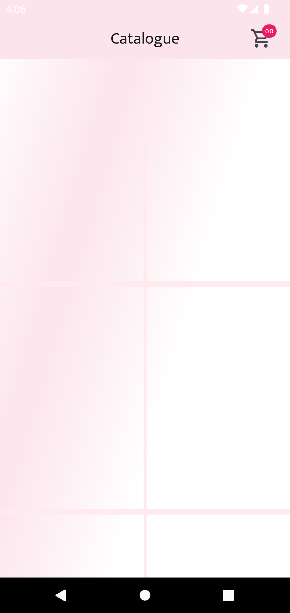
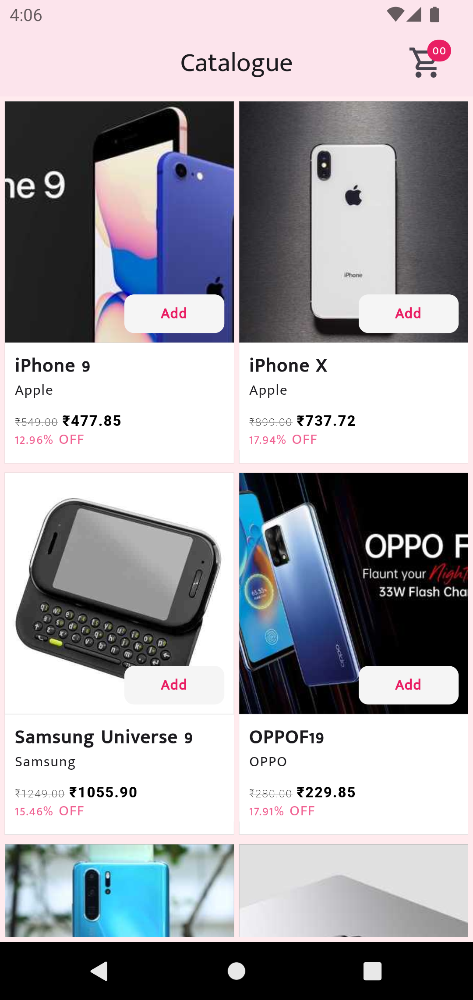
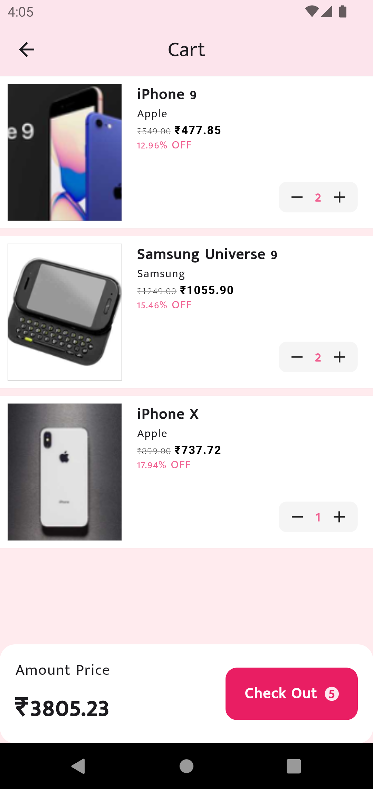
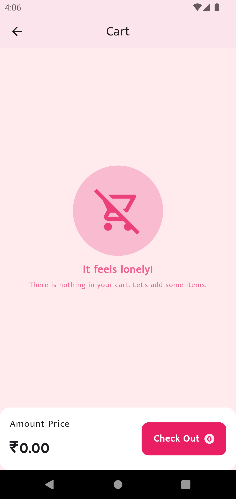

# cart_app_63

Flutter project to implement cart feature.

## Getting Started

### Flutter Task Details

- Create a basic shopping cart interface with a list of products and their prices. Price should be displayed after applying the discount percentage .
- implement a button to add a selected product to the cart.
- Display a summary  of items in the cart along with the total price (calculated by multiplying quantity and price).
- Refer mentioned API to fetch the products.  https://dummyjson.com/products
- For state management use BLOC or Riverpod.

### Implementation Details

### UI Inspiration
- https://play.google.com/store/apps/details?id=com.myntra.android&hl=en&gl=US
- https://dribbble.com/shots/15498647-Skincare-Mobile-App

### API
#### Dummy Products Paginated API
https://dummyjson.com/products

### Technicals
1. Flutter
2. Riverpod
3. Dio
4. APIs 
5. Clean Project Structure
6. GoRouter

## Feature List
1. Pixel Perfect UI
2. API Integration
3. Paginated API
4. Minimal 3rd party dependencies
5. Riverpod based state management
6. API caching on Isar Store

### Downloadable APK
1. [APK arm64](https://github.com/khurramrizvi/cart_app_63/blob/main/release/apk/app-arm64-v8a-release.apk) -> Latest Android Devices
2. [APK armeabi](https://github.com/khurramrizvi/cart_app_63/blob/main/release/apk/app-armeabi-v7a-release.apk) -> Older Android Devices
3. [APK x86_64](https://github.com/khurramrizvi/cart_app_63/blob/main/release/apk/app-x86_64-release.apk) -> Intel based CPU Android Devices

### Screens
| Loading   | Catalogue   | Cart Screen                            | Cart Empty             |
|---        |---          |---                      |---
|  |  |    |  
